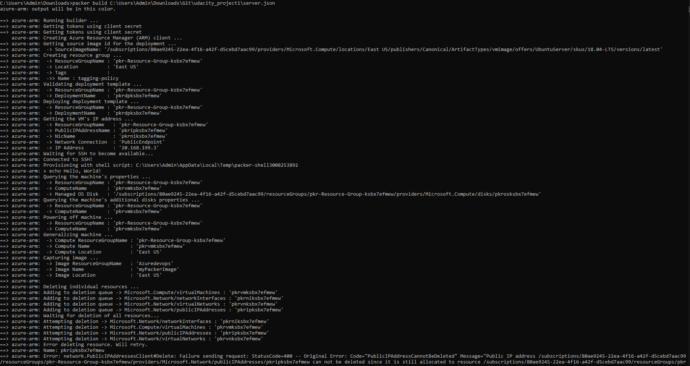
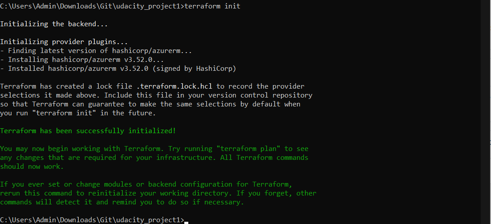
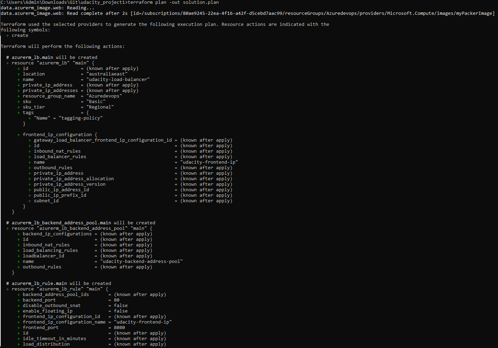
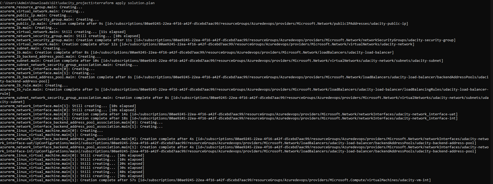
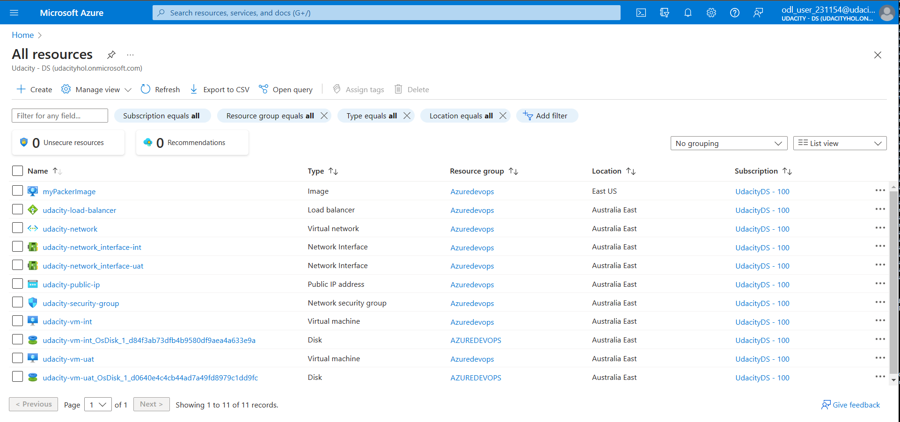

# Udacity Azure Dev-Ops Project 1: Deploying a Web Server in Azure

## Introduction
This is a project related to Udacity Azure DevOps nanodegree.
In this project, you will write a Packer template and a Terraform template to deploy a customizable, scalable web server in Azure

## Getting Started
1. Clone this repository

2. Create your infrastructure as code

3. Update this README to reflect how someone would use your code.

## Dependencies

- Create an [Azure Account](https://portal.azure.com) 
- Install the [Azure command line interface (Azure CLI )](https://docs.microsoft.com/en-us/cli/azure/install-azure-cli?view=azure-cli-latest)
- Install [Packer](https://www.packer.io/downloads)
- Install [Terraform](https://www.terraform.io/downloads.html)

## Deploy

### Export the variable

Add to your .bashrc (or .zshrc) file:

```
export AZ_CLIENT_ID=00000000-0000-0000-0000-000000000000
export AZ_CLIENT_SECRET=000000000000000000000
export AZ_TENANT_ID=00000000-0000-0000-0000-000000000000
export AZ_SUSCRIPTION_ID=00000000-0000-0000-0000-000000000000
```

(Obviously, change the value with yours.)

### Deploy the policy

Deploy the policy (I did it on Azure Portal) and assign it to the resource group.

### Create the Packer image

```
$ packer build packer/server.json
```

### Initialize Terraform deployment

```
$ terraform init
```

### Terraform execution plan
- Terraform plan command creates plan
```
$ terraform plan -out solution.plan
```

### Deploy with Terraform

```
$ terraform apply "solution.plan"
```

## How to customize vars.tf

Ex: If you want to deploy on other servers, you need to change values default in vars.tf file
```
  variable "server_names"{
  type = list
  default = ["<Server_1>","Server_2"]
}
```

## After

Destroy the infrastructure with:

```
$ terraform deploy
```
Terraform will perform:

